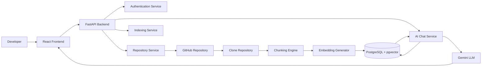
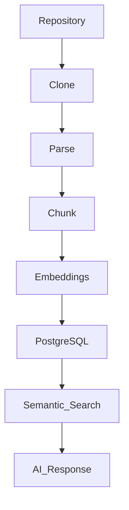
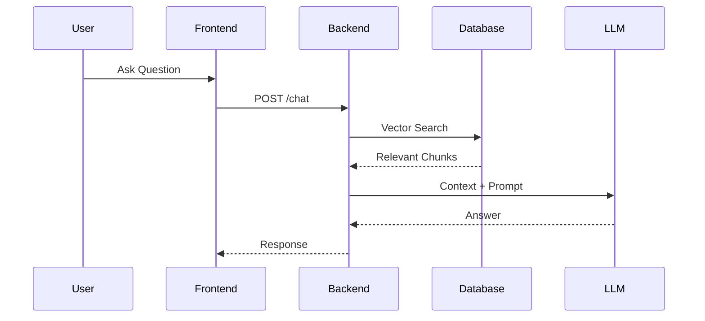

<div align="center">

# 🚀 CodeForge AI

### AI-Powered Repository Intelligence Platform

Build • Index • Search • Chat with Code Using Large Language Models


</div>

---

# 📖 Overview

CodeForge AI is an AI-powered developer platform that enables developers to understand large codebases through semantic search and natural language conversations.

Instead of manually navigating thousands of lines of source code, CodeForge AI indexes repositories, generates vector embeddings, retrieves the most relevant code snippets, and uses Large Language Models (LLMs) to produce accurate, repository-aware answers.

---

# ✨ Features

### 🔐 Authentication

- JWT-based authentication
- Secure password hashing
- Protected API endpoints
- User registration and login

### 📂 Repository Management

- Connect GitHub repositories
- Clone repositories locally
- Repository indexing
- Index status tracking

### 🧠 AI Code Intelligence

- Semantic code search
- Repository-aware AI chat
- Intelligent code chunking
- Vector embeddings
- Context retrieval

### ⚡ Retrieval-Augmented Generation (RAG)

- Automatic repository indexing
- Embedding generation
- Vector similarity search
- Context-aware LLM responses

---

# 🏗️ Architecture



---

# 🔄 Repository Indexing Pipeline



---

# 💬 Query Flow



---

# 🛠 Tech Stack

| Category | Technologies |
|-----------|--------------|
| Frontend | React, TypeScript, Vite, Tailwind CSS |
| Backend | FastAPI, SQLAlchemy, Alembic |
| Database | PostgreSQL, pgvector |
| AI | Google Gemini, Sentence Transformers |
| Authentication | JWT, bcrypt |
| DevOps | Docker, Docker Compose |
| Version Control | Git & GitHub |

---

# 📂 Project Structure

```
CodeForge-AI
│
├── backend/
│   ├── app/
│   ├── alembic/
│   ├── tests/
│   └── pyproject.toml
│
├── frontend/
│   ├── src/
│   ├── public/
│   └── package.json
│
├── docs/
│
├── docker-compose.yml
│
└── README.md
```

---

# 🚀 Getting Started

## Clone Repository

```bash
git clone https://github.com/yourusername/codeforge-ai.git

cd codeforge-ai
```

## Backend

```bash
cd backend

python -m venv .venv

# Windows
.venv\Scripts\activate

pip install -r requirements.txt
```

## Configure Environment

Create a `.env`

```env
DATABASE_URL=

SECRET_KEY=

JWT_ALGORITHM=HS256

ACCESS_TOKEN_EXPIRE_MINUTES=30

GEMINI_API_KEY=
```

## Start Database

```bash
docker compose up -d
```

## Run Migrations

```bash
alembic upgrade head
```

## Start Backend

```bash
uvicorn app.main:app --reload
```

## Start Frontend

```bash
cd frontend

npm install

npm run dev
```

---

# 📚 API Documentation

After starting the backend:

Swagger UI

```
http://localhost:8000/docs
```

OpenAPI

```
http://localhost:8000/openapi.json
```

---

# ⚙️ Design Decisions

| Decision | Why? |
|----------|------|
| FastAPI | High performance, async support, automatic API documentation |
| PostgreSQL + pgvector | Combines relational storage with vector search in one database |
| JWT Authentication | Stateless, scalable authentication |
| Repository Chunking | Handles repositories larger than an LLM's context window |
| RAG Pipeline | Provides repository-aware answers with lower hallucination rates |
| Layered Architecture | Separates API, business logic, repositories, and database access |

---

# 🚧 Engineering Challenges

### Repository Scale

Large repositories cannot fit inside an LLM context window.

**Solution:** Implemented semantic chunking and vector embeddings to retrieve only relevant code.

---

### Accurate Code Search

Keyword search often misses semantically related code.

**Solution:** Used embedding-based similarity search with pgvector for natural language retrieval.

---

### Secure Access

Repository data should only be available to authenticated users.

**Solution:** JWT authentication with password hashing and protected endpoints.

---

### Efficient Indexing

Generating embeddings repeatedly is expensive.

**Solution:** Store indexed embeddings and metadata to enable fast reuse during future queries.

---

# 📚 Key Learnings

Building CodeForge AI provided practical experience in:

- Designing scalable REST APIs
- JWT authentication and authorization
- Database schema migration with Alembic
- Vector databases and semantic search
- Retrieval-Augmented Generation (RAG)
- LLM integration
- Repository indexing pipelines
- Docker-based development
- Full-stack React + FastAPI development
- Clean layered software architecture

---

# 🔒 Security

- JWT authentication
- Password hashing (bcrypt)
- Protected API endpoints
- Environment-based secret management
- SQLAlchemy ORM
- Repository ownership validation

---

# 🛣️ Future Roadmap

### AI

- AI-powered code review
- Pull request analysis
- Bug detection
- Documentation generation
- Multi-LLM support

### Platform

- Incremental repository indexing
- Background task processing
- Team collaboration
- Role-Based Access Control (RBAC)
- Repository sharing

### DevOps

- GitHub Actions CI/CD
- Kubernetes deployment
- Monitoring & logging
- Automated testing pipeline
- Production deployment

---

# 📸 Screenshots

| Login | Dashboard |
|-------|-----------|
| *Add Screenshot* | *Add Screenshot* |

| Repository | AI Chat |
|------------|---------|
| *Add Screenshot* | *Add Screenshot* |

---

# 🤝 Contributing

Contributions are welcome.

1. Fork the repository
2. Create a feature branch
3. Commit your changes
4. Open a Pull Request

---

# 📄 License

This project is licensed under the **MIT License**.

---

<div align="center">

### ⭐ If you found this project useful, consider giving it a star!

**Built with ❤️ using FastAPI, React, PostgreSQL, pgvector, and AI**

</div>
