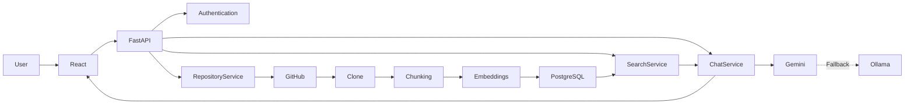
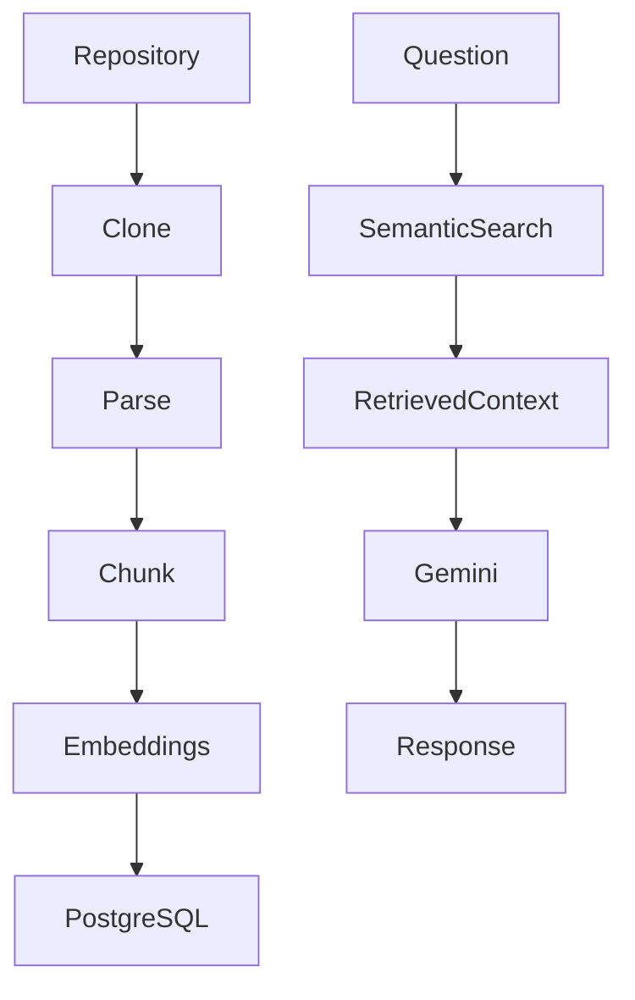
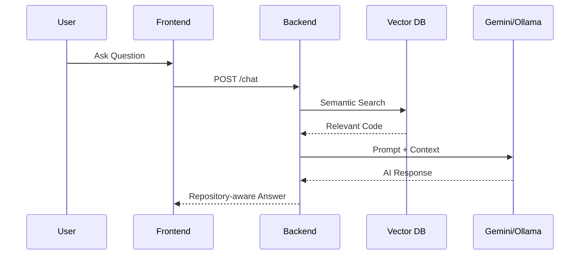

<div align="center">

# 🚀 CodeForge AI

### AI-Powered Repository Intelligence Platform

**Build • Index • Search • Chat with Code Using Large Language Models**


</div>

---

# 📖 Overview

CodeForge AI is an AI-powered repository intelligence platform that helps developers understand large codebases using **semantic search**, **Retrieval-Augmented Generation (RAG)**, and **Large Language Models (LLMs)**.

Instead of manually navigating thousands of lines of source code, CodeForge AI clones GitHub repositories, indexes source files, generates vector embeddings, retrieves relevant code using hybrid semantic search, and produces repository-aware answers using **Google Gemini**, with **Ollama** as a local fallback.

---

# ✨ Features

### 🔐 Authentication

- JWT authentication
- Google OAuth
- GitHub OAuth
- Password reset
- Protected API endpoints

### 📂 Repository Management

- Connect GitHub repositories
- Clone repositories locally
- Background indexing
- Repository status tracking

### 🧠 AI Code Intelligence

- Repository-aware AI chat
- Hybrid semantic search
- Intelligent code chunking
- Vector embeddings
- Context retrieval

### ⚡ RAG Pipeline

- Automatic repository indexing
- Embedding generation
- pgvector similarity search
- Context-aware AI responses
- Gemini with Ollama fallback

---

# 🏗️ System Architecture



---

# 🔄 Repository Indexing Pipeline



---

# 💬 AI Query Flow



---

# 🛠 Tech Stack

| Category | Technologies |
|-----------|--------------|
| Frontend | React, TypeScript, Vite, Tailwind CSS |
| Backend | FastAPI, SQLAlchemy, Alembic |
| Database | PostgreSQL, pgvector |
| AI | Google Gemini, Ollama, Sentence Transformers |
| Authentication | JWT, Google OAuth, GitHub OAuth |
| DevOps | Docker, Docker Compose |
| Version Control | Git & GitHub |

---

# 📂 Project Structure

```text
codeforge-ai/
│
├── backend/
├── frontend/
├── docs/
├── docker-compose.yml
└── README.md
```

---

# 🚀 Getting Started

## Clone

```bash
git clone https://github.com/impanamu/codeforge-ai.git

cd codeforge-ai
```

## Backend

```bash
cd backend

python -m venv .venv

# Windows
.venv\Scripts\activate

pip install -r requirements.txt
```

## Configure Environment

Create a `.env`

```env
DATABASE_URL=

SECRET_KEY=

JWT_ALGORITHM=HS256

ACCESS_TOKEN_EXPIRE_MINUTES=30

GEMINI_API_KEY=

OLLAMA_BASE_URL=http://localhost:11434
```

## Start PostgreSQL

```bash
docker compose up -d
```

## Run Migrations

```bash
alembic upgrade head
```

## Start Backend

```bash
uvicorn app.main:app --reload
```

## Start Frontend

```bash
cd frontend

npm install

npm run dev
```

---

# 📚 Documentation

Detailed technical documentation is available in the `docs` folder.

- 🏗️ [Architecture & Developer Guide](docs/architecture.md)
- 🔌 [API Reference](docs/api-reference.md)
- 🚀 [Deployment Guide](docs/deployment.md)

---

# 📚 API Documentation

After starting the backend:

**Swagger**

```text
http://localhost:8000/docs
```

**OpenAPI**

```text
http://localhost:8000/openapi.json
```

---

# ⚙️ Design Decisions

| Decision | Reason |
|----------|--------|
| FastAPI | High-performance asynchronous backend with automatic API documentation |
| PostgreSQL + pgvector | Combines relational storage with efficient vector similarity search |
| Hybrid Search | Combines semantic similarity with keyword matching for improved retrieval accuracy |
| RAG | Grounds LLM responses in repository context to reduce hallucinations |
| Gemini + Ollama | Cloud-based LLM with a local fallback for reliability |
| Layered Architecture | Clear separation of API, services, repositories, and database logic |

---

# 🚧 Engineering Challenges

- Processing repositories larger than an LLM context window.
- Retrieving semantically relevant code instead of relying solely on keyword matching.
- Efficiently storing and reusing embeddings to avoid repeated indexing.
- Supporting both cloud and local LLM providers through a fallback mechanism.
- Maintaining clean separation between the frontend, backend, indexing pipeline, and AI services.

---

# 📚 Key Learnings

Through this project I gained experience with:

- Retrieval-Augmented Generation (RAG)
- Semantic search and vector databases
- pgvector and embedding pipelines
- Sentence Transformers
- FastAPI and React integration
- OAuth authentication
- Docker-based development
- Layered software architecture
- LLM orchestration with Gemini and Ollama

---

# 🔒 Security

- JWT authentication
- OAuth login (Google & GitHub)
- Password hashing with bcrypt
- Environment-based secret management
- Protected API endpoints
- Repository ownership validation

---

# 🛣️ Future Roadmap

### AI

- AI code review
- Pull request analysis
- Bug detection
- Documentation generation
- Multi-agent workflows

### Platform

- Incremental indexing
- Background task queue
- Team collaboration
- Role-Based Access Control (RBAC)
- Repository sharing

### DevOps

- CI/CD with GitHub Actions
- Kubernetes deployment
- Monitoring and observability
- Automated testing
- Cloud deployment

---

# 📸 Screenshots

| Login | Dashboard |
|-------|-----------|
| *(Coming Soon)* | *(Coming Soon)* |

| Repository | AI Chat |
|------------|---------|
| *(Coming Soon)* | *(Coming Soon)* |

---

# 🤝 Contributing

Contributions are welcome.

1. Fork the repository.
2. Create a feature branch.
3. Commit your changes.
4. Open a Pull Request.

---

# 📄 License

This project is licensed under the **MIT License**.

---

<div align="center">

⭐ If you found this project useful, consider giving it a star!

**Built with FastAPI, React, PostgreSQL, pgvector, Gemini, Ollama, and modern AI technologies.**

</div>