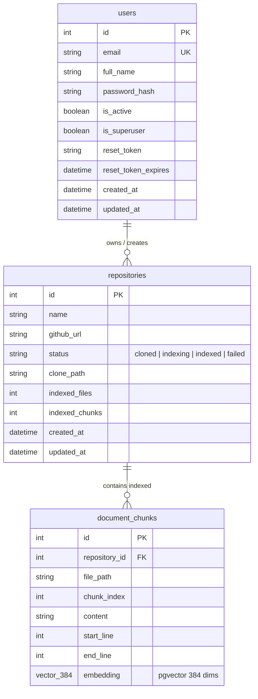
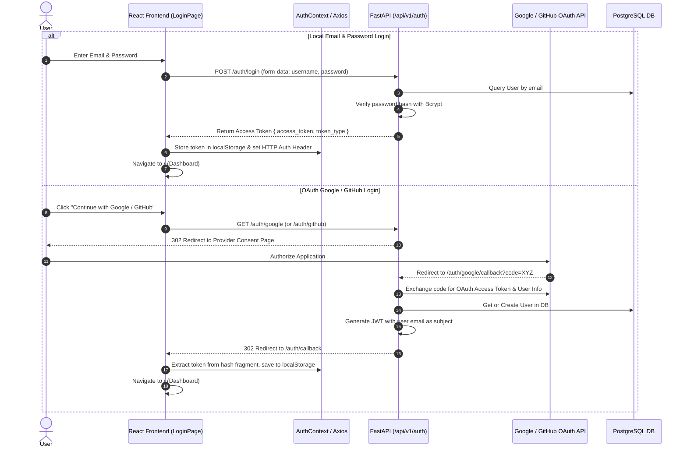
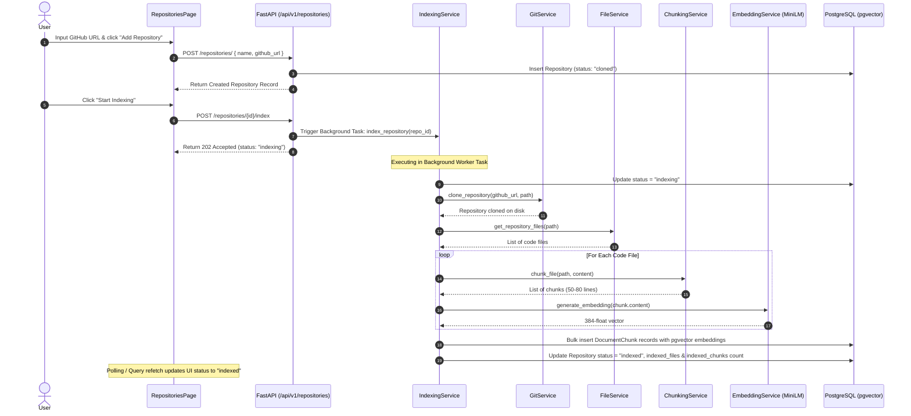
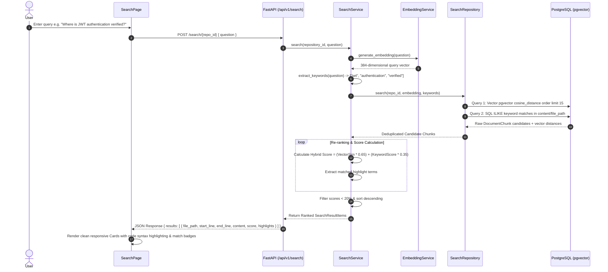
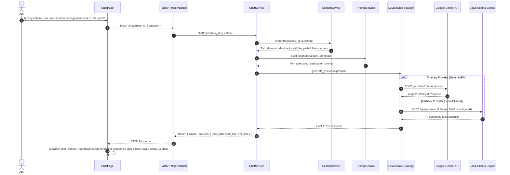

# 🚀 CodeForge AI — Complete Architecture Guide

Welcome to the **CodeForge AI** ! This document serves as the comprehensive architectural reference, API specification, code execution trace, and developer manual for the CodeForge AI platform.

Whether you are modifying the RAG pipeline, adding a backend service, creating a React component, or optimizing vector search, this guide provides end-to-end clarity on how every layer of the system operates.

---

## 📑 Table of Contents

- [🚀 CodeForge AI — Complete Architecture Guide](#-codeforge-ai--complete-architecture-guide)
  - [📑 Table of Contents](#-table-of-contents)
  - [🛠️ System Overview \& Tech Stack](#️-system-overview--tech-stack)
    - [Backend Infrastructure](#backend-infrastructure)
    - [Frontend Application](#frontend-application)
  - [📐 High-Level System Architecture Diagram](#-high-level-system-architecture-diagram)
  - [🗄️ Database Models \& Entity Relationship Diagram](#️-database-models--entity-relationship-diagram)
    - [Table Definitions \& Constraints](#table-definitions--constraints)
  - [📁 Folder \& Directory Structure Guide](#-folder--directory-structure-guide)
  - [⚙️ Backend Core Architecture \& Services](#️-backend-core-architecture--services)
    - [Key Backend Services Breakdown](#key-backend-services-breakdown)
      - [1. `UserService` (`app/services/user_service.py`)](#1-userservice-appservicesuser_servicepy)
      - [2. `GitService` (`app/services/git_service.py`)](#2-gitservice-appservicesgit_servicepy)
      - [3. `FileService` (`app/services/file_service.py`)](#3-fileservice-appservicesfile_servicepy)
      - [4. `ChunkingService` (`app/services/chunking_service.py`)](#4-chunkingservice-appserviceschunking_servicepy)
      - [5. `EmbeddingService` (`app/services/embedding_service.py`)](#5-embeddingservice-appservicesembedding_servicepy)
      - [6. `IndexingService` (`app/services/indexing_service.py`)](#6-indexingservice-appservicesindexing_servicepy)
      - [7. `SearchService` (`app/services/search_service.py`)](#7-searchservice-appservicessearch_servicepy)
      - [8. `ChatService` \& RAG Pipeline (`app/services/chat_service.py`)](#8-chatservice--rag-pipeline-appserviceschat_servicepy)
  - [🎨 Frontend Architecture \& Component System](#-frontend-architecture--component-system)
    - [Key UI Components](#key-ui-components)
  - [🔄 Sequence Diagrams for Major Execution Workflows](#-sequence-diagrams-for-major-execution-workflows)
    - [Workflow 1: Authentication \& OAuth Flow](#workflow-1-authentication--oauth-flow)
    - [Workflow 2: Repository Cloning \& Background Indexing](#workflow-2-repository-cloning--background-indexing)
    - [Workflow 3: Hybrid Semantic Search](#workflow-3-hybrid-semantic-search)
    - [Workflow 4: RAG AI Pair Programming Chat](#workflow-4-rag-ai-pair-programming-chat)
  - [🔌 Complete API Reference \& End-to-End Code Traces](#-complete-api-reference--end-to-end-code-traces)
    - [1. Authentication Endpoints (`/auth`)](#1-authentication-endpoints-auth)
    - [2. User Profile Endpoints (`/users`)](#2-user-profile-endpoints-users)
    - [3. Repository Management Endpoints (`/repositories`)](#3-repository-management-endpoints-repositories)
    - [4. Search \& Chat Endpoints (`/search` \& `/chat`)](#4-search--chat-endpoints-search--chat)
    - [5. System Health Endpoints (`/health`)](#5-system-health-endpoints-health)
  - [🏃 Step-by-Step User Journey Walkthrough](#-step-by-step-user-journey-walkthrough)

---

## 🛠️ System Overview & Tech Stack

CodeForge AI is a full-stack, enterprise-grade AI-powered code analysis and RAG (Retrieval-Augmented Generation) platform. It allows software engineers to connect Git repositories, automatically index codebase structures into 384-dimensional vector embeddings, run hybrid semantic searches, and pair-program with an AI assistant that grounds its answers in the repository's exact source code.

### Backend Infrastructure
- **Framework**: [FastAPI](https://fastapi.tiangolo.com/) (Python 3.11+)
- **Database**: PostgreSQL with [pgvector](https://github.com/pgvector/pgvector) extension
- **ORM & Migrations**: SQLAlchemy 2.0 (mapped column syntax) + Alembic
- **Vector Embeddings**: `sentence-transformers/all-MiniLM-L6-v2` (384 dimensions)
- **AI / LLM Orchestration**: Dual-provider strategy:
  - **Primary**: Google Gemini API (`gemini-1.5-flash` / `gemini-1.5-pro`)
  - **Fallback**: Local [Ollama](https://ollama.ai/) (`codellama` / `llama3`)
- **Authentication**: JWT (JSON Web Tokens) with standard OAuth2 password bearer flow + Google OAuth 2.0 + GitHub OAuth 2.0

### Frontend Application
- **Core Framework**: React 18 + Vite
- **Routing**: React Router v6
- **State & Query Management**: TanStack Query v5 (React Query) + Context API (`AuthContext`, `ThemeContext`, `ToastContext`)
- **UI Components & Styling**: Vanilla CSS design system (CSS custom properties, glassmorphism, dark/light themes)
- **Animations**: Framer Motion
- **Syntax Highlighting & Markdown**: `react-syntax-highlighter` (Prism) + `react-markdown` + `remark-gfm`

---

## 📐 High-Level System Architecture Diagram

```mermaid
graph TD
    User([User Browser / Client])
    
    subgraph Frontend ["React 18 + Vite Frontend"]
        AuthContext["AuthContext (JWT in localStorage)"]
        AxiosClient["Axios Client (Bearer Interceptor)"]
        Router["React Router v6"]
        Pages["Pages (Dashboard, Repos, Search, Chat, Profile)"]
    end
    
    subgraph FastAPI ["FastAPI Backend (/api/v1)"]
        AuthMiddleware["OAuth2 & JWT Auth Dependency"]
        APIRouters["API Routers (auth, users, repos, search, chat, health)"]
        
        subgraph Services ["Core Application Services"]
            UserService["UserService"]
            RepoService["RepositoryService"]
            GitService["GitService (git clone)"]
            FileService["FileService (traverse & filter)"]
            ChunkService["ChunkingService (window splitting)"]
            EmbedService["EmbeddingService (MiniLM-L6)"]
            IndexService["IndexingService (Pipeline Manager)"]
            SearchService["SearchService (Hybrid Ranking)"]
            ChatService["ChatService (RAG Engine)"]
            LLMService["LLMService (Gemini / Ollama)"]
        end
        
        subgraph Repositories ["Data Repositories"]
            UserRepo["UserRepository"]
            RepoRepo["RepositoryRepository"]
            SearchRepo["SearchRepository (pgvector)"]
        end
    end
    
    subgraph External ["External Services & Local Engines"]
        GoogleOAuth["Google OAuth 2.0 API"]
        GitHubOAuth["GitHub OAuth 2.0 API"]
        GeminiAPI["Google Gemini AI API"]
        OllamaLocal["Ollama Local LLM (Fallback)"]
        GitHubGit["GitHub / Remote Git Repositories"]
    end
    
    subgraph Storage ["Database & Storage Layer"]
        PostgresDB[("PostgreSQL DB + pgvector")]
        WorkspaceDisk["Local Workspace Disk Storage"]
    end
    
    User <--> Router
    Router <--> Pages
    Pages <--> AuthContext
    Pages <--> AxiosClient
    AxiosClient <--> API_ROUTERS
    
    APIRouters <--> AuthMiddleware
    APIRouters <--> Services
    Services <--> Repositories
    Repositories <--> PostgresDB
    
    GitService <--> GitHubGit
    GitService <--> WorkspaceDisk
    FileService <--> WorkspaceDisk
    LLMService <--> GeminiAPI
    LLMService <--> OllamaLocal
    APIRouters <--> GoogleOAuth
    APIRouters <--> GitHubOAuth
```



---

## 🗄️ Database Models & Entity Relationship Diagram

The database uses PostgreSQL with the `pgvector` extension enabled.



### Table Definitions & Constraints
1. **`users`**:
   - `id`: Auto-incrementing primary key.
   - `email`: Indexed unique string used for authentication.
   - `password_hash`: Bcrypt hashed password.
   - `reset_token` / `reset_token_expires`: Used for email password reset token validation.
2. **`repositories`**:
   - `status`: State machine string (`cloned`, `indexing`, `indexed`, `failed`).
   - `clone_path`: Local disk location where the Git repo is stored (`backend/workspaces/{repo_id}`).
3. **`document_chunks`**:
   - `repository_id`: Foreign key with `ON DELETE CASCADE`.
   - `embedding`: Vector(384) column powered by `pgvector`. Indexed with HNSW or IVFFlat for fast cosine distance matching.

---

## 📁 Folder & Directory Structure Guide

```
codeforge-ai/
├── backend/
│   ├── alembic/                      # Database migration scripts
│   ├── app/
│   │   ├── api/v1/
│   │   │   ├── endpoints/            # REST API endpoints (auth, repos, search, chat, etc.)
│   │   │   └── router.py             # Main API v1 router aggregator
│   │   ├── core/                     # Application configurations, Security, JWT
│   │   ├── db/                       # DB Session initialization & extensions
│   │   ├── dependencies/             # FastAPI Dependency Injection (Auth, DB)
│   │   ├── models/                   # SQLAlchemy ORM Data Models
│   │   ├── repositories/             # Database Access Layer (User, Repo, Search)
│   │   ├── schemas/                  # Pydantic request/response validation schemas
│   │   ├── services/                 # Core Business Logic & Pipelines
│   │   │   └── llm/                  # Gemini & Ollama Provider Strategy
│   │   └── main.py                   # FastAPI Application Entry Point
│   ├── workspaces/                   # Cloned Git repositories workspace dir
│   ├── alembic.ini                   # Alembic configuration
│   └── requirements.txt              # Backend dependencies
├── frontend/
│   ├── src/
│   │   ├── api/                      # Axios HTTP client & endpoint service functions
│   │   ├── components/
│   │   │   ├── common/               # UI Design System (Button, Card, Badge, Modal, etc.)
│   │   │   └── layout/               # App Layout, Navbar, Sidebar, ProtectedRoute
│   │   ├── context/                  # React Contexts (Auth, Theme, Toast)
│   │   ├── hooks/                    # Custom hooks (Queries, Animations, Keyboard)
│   │   ├── pages/                    # Page Views (Login, Register, Dashboard, Repos, Search, Chat)
│   │   ├── styles/                   # Global CSS design tokens & animations
│   │   ├── App.jsx                   # Root App Component & Route Provider
│   │   └── main.jsx                  # React DOM Entry
│   ├── index.html
│   ├── package.json
│   └── vite.config.js
```

---

## ⚙️ Backend Core Architecture & Services

The backend follows a strict **Layered Architecture**:
$$\text{Endpoint (API Router)} \longrightarrow \text{Service (Business Logic)} \longrightarrow \text{Repository (Data Access)} \longrightarrow \text{Database (SQLAlchemy)}$$

### Key Backend Services Breakdown

#### 1. `UserService` (`app/services/user_service.py`)
- **Responsibility**: User registration, login verification, password hashing, and token generation.
- **Key Methods**:
  - `authenticate_user(email, password)`: Verifies user exists and password matches hash.
  - `create_user(user_in)`: Hashes password with bcrypt and inserts user record.
  - `request_password_reset(email)`: Generates reset token and sets 1-hour expiration.
  - `reset_password(token, new_password)`: Validates token expiration and updates hash.

#### 2. `GitService` (`app/services/git_service.py`)
- **Responsibility**: Clones remote Git repositories into `backend/workspaces/{repository_id}`.
- **Key Methods**:
  - `clone_repository(github_url, destination_path)`: Executes Git clone or pulls latest changes.

#### 3. `FileService` (`app/services/file_service.py`)
- **Responsibility**: Traverses the cloned repository workspace directory, respecting `.gitignore` rules and ignoring binary or non-code extensions (`.png`, `.exe`, `.pyc`, `.git`).
- **Key Methods**:
  - `get_repository_files(repo_path)`: Returns a list of text code file paths.

#### 4. `ChunkingService` (`app/services/chunking_service.py`)
- **Responsibility**: Splitting raw code file content into semantic chunks with overlapping line windows.
- **Key Methods**:
  - `chunk_file(file_path, content)`: Creates chunks of ~50-80 lines with a 10-line overlap, maintaining `start_line` and `end_line` metadata.

#### 5. `EmbeddingService` (`app/services/embedding_service.py`)
- **Responsibility**: Loads `sentence-transformers/all-MiniLM-L6-v2` locally and converts text strings into 384-dimensional floating-point vector lists.
- **Key Methods**:
  - `generate_embedding(text)`: Returns `list[float]` of length 384.

#### 6. `IndexingService` (`app/services/indexing_service.py`)
- **Responsibility**: The master pipeline orchestrator for codebase ingestion.
- **Pipeline Execution Steps**:
  1. Set repository status to `indexing`.
  2. Clone repository via `GitService`.
  3. Scan files via `FileService`.
  4. Chunk code files via `ChunkingService`.
  5. Generate embeddings for all chunks via `EmbeddingService`.
  6. Bulk insert `DocumentChunk` records into PostgreSQL.
  7. Update repository status to `indexed` with `indexed_files` and `indexed_chunks` metrics.

#### 7. `SearchService` (`app/services/search_service.py`)
- **Responsibility**: Implements **Hybrid Retrieval** combining vector similarity search with SQL `ILIKE` keyword filtering.
- **Hybrid Score Calculation**:
  $$\text{Hybrid Score} = (\text{Vector Similarity} \times 0.65) + (\text{Keyword Match Score} \times 0.35)$$
- Filter out results under similarity thresholds and returns sorted top matches with matched keyword concept highlights.

#### 8. `ChatService` & RAG Pipeline (`app/services/chat_service.py`)
- **Responsibility**: Executes Retrieval-Augmented Generation for AI pairing.
- **RAG Steps**:
  1. Calls `SearchService.search()` to find top code context chunks.
  2. Constructs a strict prompt with source attribution (`File: ... Lines: ...`).
  3. Sends prompt to `LLMService` (Gemini API with Ollama fallback).
  4. Returns AI response with precise source file references.

---

## 🎨 Frontend Architecture & Component System

The frontend application uses a **Component-Driven State Architecture** powered by React Router and TanStack Query.

```
[ App.jsx ]
  ├── ToastProvider (Toast Notifications)
  ├── ThemeProvider (Dark / Light Mode Toggle)
  └── AuthProvider (User Session, LocalStorage Token, Login/Logout)
        └── RouterProvider
              ├── Public Routes: /login, /register, /forgot-password, /reset-password, /auth/callback
              └── Protected Routes (AppLayout wrapper):
                    ├── Navbar (Repo Selector, Theme Toggle, User Menu)
                    ├── Sidebar (Navigation links)
                    ├── DashboardPage (/dashboard)
                    ├── RepositoriesPage (/repositories)
                    ├── RepositoryDetailPage (/repositories/:id)
                    ├── SearchPage (/search)
                    ├── ChatPage (/chat)
                    └── ProfilePage (/profile)
```

### Key UI Components
- **`Card`**: Standardized container with glassmorphism, subtle borders, and optional Framer Motion hover elevation.
- **`Button`**: Customizable button supporting `primary`, `secondary`, `danger`, `ghost` variants, with built-in loading spinner states.
- **`Badge`**: Status indicators (`success` green, `warning` amber, `info` blue, `danger` red).
- **`Input`**: Form input with icon support, error messages, and focus rings.

---

## 🔄 Sequence Diagrams for Major Execution Workflows

### Workflow 1: Authentication & OAuth Flow



---

### Workflow 2: Repository Cloning & Background Indexing



---

### Workflow 3: Hybrid Semantic Search



---

### Workflow 4: RAG AI Pair Programming Chat



---

## 🔌 Complete API Reference & End-to-End Code Traces

All API endpoints are prefixed with `/api/v1`.

### 1. Authentication Endpoints (`/auth`)

| Method | Route | Request Body | Response Schema | Auth Required | Purpose | Calling Component |
|---|---|---|---|---|---|---|
| `POST` | `/auth/login` | `OAuth2PasswordRequestForm` (`username`, `password`) | `Token` (`access_token`, `token_type`) | ❌ None | Authenticate user & issue JWT | `LoginPage.jsx` |
| `POST` | `/auth/register` | `UserCreate` (`email`, `full_name`, `password`) | `UserResponse` | ❌ None | Register a new account | `RegisterPage.jsx` |
| `POST` | `/auth/forgot-password` | `ForgotPasswordRequest` (`email`) | `{ message, reset_link }` | ❌ None | Trigger password reset | `ForgotPasswordPage.jsx` |
| `POST` | `/auth/reset-password` | `ResetPasswordRequest` (`token`, `new_password`) | `{ message }` | ❌ None | Set new password | `ResetPasswordPage.jsx` |
| `GET` | `/auth/google` | Query params | 302 Redirect | ❌ None | Initiate Google OAuth | `LoginPage` / `RegisterPage` |
| `GET` | `/auth/google/callback` | `code`, `error` | 302 Redirect to Frontend | ❌ None | Google OAuth callback | Browser Redirect |
| `GET` | `/auth/github` | Query params | 302 Redirect | ❌ None | Initiate GitHub OAuth | `LoginPage` / `RegisterPage` |
| `GET` | `/auth/github/callback` | `code`, `error` | 302 Redirect to Frontend | ❌ None | GitHub OAuth callback | Browser Redirect |

---

### 2. User Profile Endpoints (`/users`)

| Method | Route | Request Body | Response Schema | Auth Required | Purpose | Calling Component |
|---|---|---|---|---|---|---|
| `GET` | `/users/me` | None | `UserResponse` (`id`, `email`, `full_name`, `is_active`, `is_superuser`) | 🔒 Bearer JWT | Fetch authenticated user details | `AuthContext.jsx` |

---

### 3. Repository Management Endpoints (`/repositories`)

| Method | Route | Request Body | Response Schema | Auth Required | Purpose | Calling Component |
|---|---|---|---|---|---|---|
| `GET` | `/repositories` | None | `list[RepositoryResponse]` | 🔒 Bearer JWT | List all repositories | `RepositoriesPage`, Navbar |
| `POST` | `/repositories` | `RepositoryCreate` (`name`, `github_url`) | `RepositoryResponse` | 🔒 Bearer JWT | Create & clone a repository | `RepositoriesPage.jsx` |
| `GET` | `/repositories/{id}` | None | `RepositoryResponse` | 🔒 Bearer JWT | Get repository details | `RepositoryDetailPage.jsx` |
| `DELETE` | `/repositories/{id}` | None | `{ message }` | 🔒 Bearer JWT | Delete repo & vector chunks | `RepositoriesPage`, Detail |
| `POST` | `/repositories/{id}/index` | None | `RepositoryResponse` | 🔒 Bearer JWT | Start background indexing | `RepositoriesPage`, Detail |

---

### 4. Search & Chat Endpoints (`/search` & `/chat`)

| Method | Route | Request Body | Response Schema | Auth Required | Purpose | Calling Component |
|---|---|---|---|---|---|---|
| `POST` | `/search/{repository_id}` | `SearchRequest` (`question`) | `SearchResponse` (`results: [{ file_path, start_line, end_line, content, score, highlights }]`) | 🔒 Bearer JWT | Execute hybrid vector/keyword code search | `SearchPage.jsx` |
| `POST` | `/chat/{repository_id}` | `ChatRequest` (`question`) | `ChatResponse` (`answer`, `sources: [{ file_path, start_line, end_line }]`) | 🔒 Bearer JWT | Ask AI pair programmer grounded questions | `ChatPage.jsx` |

---

### 5. System Health Endpoints (`/health`)

| Method | Route | Request Body | Response Schema | Auth Required | Purpose | Calling Component |
|---|---|---|---|---|---|---|
| `GET` | `/health` | None | `{ status: "healthy", service, version }` | ❌ None | Backend health status check | `ProfilePage.jsx` |

---

## 🏃 Step-by-Step User Journey Walkthrough

Here is the exact start-to-finish user path through CodeForge AI:

1. **User Landing & Authentication**:
   - The user opens `http://localhost:5173`. If unauthenticated, `ProtectedRoute` redirects to `/login`.
   - The user fills out the login form or clicks **Continue with Google / GitHub**.
   - `LoginPage` calls `authApi.login()` → FastAPI authenticates credentials → issues a JWT token.
   - `AuthContext` saves the JWT in `localStorage` and populates the user session state.

2. **Repository Creation**:
   - The user navigates to `/repositories` and inputs a repository name and GitHub URL (e.g. `https://github.com/fastapi/fastapi`).
   - `RepositoriesPage` triggers `useCreateRepository()` mutation → `POST /api/v1/repositories`.
   - Backend saves the repository record with status `cloned`.

3. **Background Repository Indexing**:
   - The user clicks **Start Indexing**.
   - `POST /api/v1/repositories/{id}/index` dispatches a FastAPI background task running `IndexingService.index_repository()`.
   - In the background, `GitService` clones the repo, `FileService` filters source code files, `ChunkingService` splits code into 50-line overlapping windows, `EmbeddingService` encodes chunks into 384-dimensional vectors, and bulk inserts them into PostgreSQL `document_chunks`.
   - Frontend polls repo status every 3 seconds until status changes to `indexed`.

4. **Semantic Code Search**:
   - The user navigates to `/search`, selects their repository, and enters a question like *"Where is user authentication handled?"*.
   - Frontend submits `POST /api/v1/search/{repo_id}`.
   - `SearchService` extracts keywords, generates a vector embedding for the query, queries pgvector for similarity, re-ranks candidate chunks using hybrid scoring, and returns ranked matches.
   - `SearchPage` renders responsive code cards with line numbers, copy buttons, match percentage badges (`🎯 88% Match`), and matched concept tags.

5. **AI Pair Programming Chat**:
   - The user navigates to `/chat` and asks *"Explain how session management works in this codebase"*.
   - `ChatPage` submits `POST /api/v1/chat/{repo_id}`.
   - `ChatService` retrieves relevant codebase context via `SearchService`, constructs a grounded RAG prompt, and streams the prompt to Gemini (with Ollama fallback).
   - `ChatPage` renders the response using typewriter animation, formatted markdown callouts (`💡 Key Idea`, `⚠️ Important`), expandable source code references, and repo-aware follow-up question chips.

---

You now have a complete understanding of CodeForge AI's architecture, database schema, service interactions, API specification, and execution flow. Happy coding!
